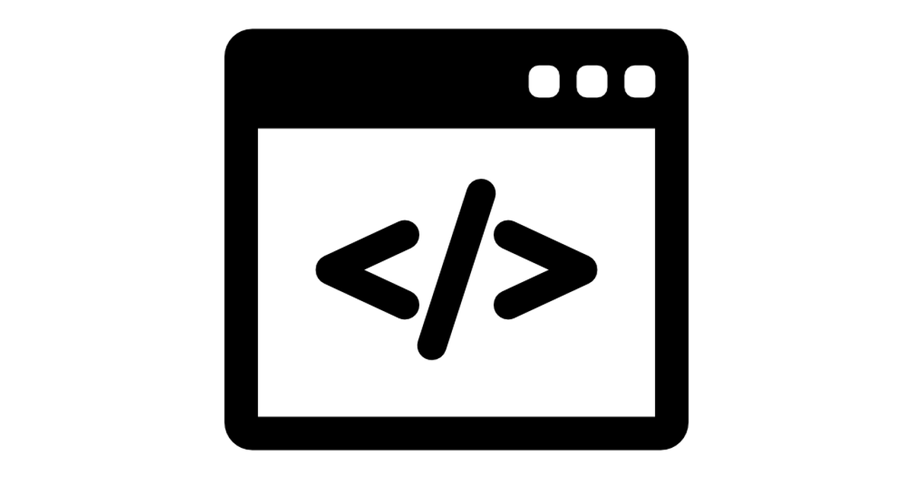
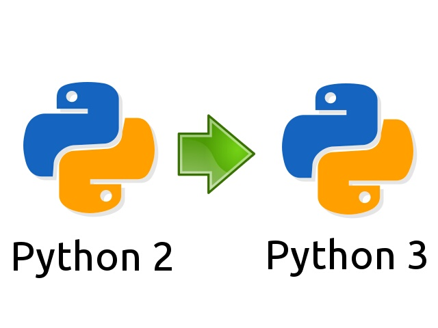

author: Sondre Halvorsen
id: programming-with-python
summary: This course is meant as an introduction to programming using Python
status: draft
feedback link:

# Learn Programing with Python!

## About this Course
Duration: 5:00


This course will walk you through the basic concepts of Programming using the Python programming language.


## Programming 1
Duration: 5:00

Programming is simply the act of entering instructions for the computer to perform. These instructions might crunch some numbers, modify text, look up information in files, or communicate with other computers over the Internet.

A program is like a:
 - Cooking recipe
 - Ikea assembly manual

But for the computer!



## Programming 2
Duration: 5:00

For most people, their computer is just an appliance instead of a tool. But by learning how to program, you’ll gain access to one of the most powerful tools of the modern world, and you’ll have fun along the way. Programming isn’t brain surgery—it’s fine for amateurs to experiment and make mistakes.

All programs, written in any language uses the same basic building blocks

Her are a few of the most common:
 - "Do this; Then do that"
 - "If this condition is true, perform this action; otherwise, do that action"
 - "Do this action that number of times"
 - "Keep doing that until this condition is true"


## Programming 3
Duration: 5:00

All programming no matter the language follows three simple steps.

1. Write code as text in a editor

2. Compile the code to machine code the computer can run

3. Run the machine code on the computer

Different programming language package these steps differently. But the steps remain the same.

 


## Python
Python is a clear and powerful object-oriented programming language, comparable to Perl, Ruby, Scheme, or Java.


Developed by Guido van Rossum

## Installation
Duration: 10:00

### Windows
 - Go to https://www.python.org/downloads/
 - Download the latest version of Python (as of this course being written: Python 3.7.2)
 - Run the installer
 - enable PATH
 
 - click [Install now]

Test that Python is properly installed by running
```bash
python --version
```
in a CMD/Powershell shell.
In case of errors reference the - Using Python on Windows page: [link](https://docs.python.org/3/using/windows.html)

### Linux

Ubuntu
```bash
sudo apt-get update
sudo apt-get install python3.7
python3 --version
```

### Mac

On macOS, the best way to install Python 3 is to use Homebrew. Not familiar with homebrew? [link](https://brew.sh/)

[tutorial to install homebrew and python](https://wsvincent.com/install-python3-mac/)

```bash
brew install python3
```

Verify installation

```bash
python3 --version
```


## Table-Of-Contents
Duration: 1:00

 There are several tools installed with the Python interpreter. Here are some of them:


| Tool      | Description  |
| ------------- |:-------------:|
| python interpreter     | The python interpreter. The executable that can be called directly from the command line prompt/terminal to start a new interactive python session (REPL) or to run python modules/files/packages |
| pip     | The Python package manager. The official Python package manager. Lets the user download and manage third-party packages hosted on the Python package index (PyPI)      | 
| IDLE | IDLE is Python’s Integrated Development and Learning Environment. Its a Python IDE for and by Python | 
| pydoc| The pydoc module automatically generates documentation from Python modules. | 


## Development Tools

Python can be used and developed with using only a basic text editor and the python interpreter. But for larger and more complex projects there is a benefit to use purpose built tools for Python development.

VSCODE is a good and free text editor: [link](https://code.visualstudio.com/)


## Python a overview
Duration: 2:00


Objects are Python’s abstraction for data. All data in a Python program is represented by objects or by relations between objects.

 - Python is strongly typed and dynamically typed.

 - Python is a general purpose programming language. It is not the best choice for time critical or memory constrained tasks.

 - Python is really a compiled programming language, but it acts as a interpreted language.

 - There exist different implementation of Python. The most common, and the one we will use in this course is CPython.

 - Python comes with "Batteries included", meaning Python comes with a feature rich standard library.


## Python 2 and Python 3
Duration: 1:00

Python has two main versions. Python 2 and Python 3. Python 3 is the newest, but it has struggled with adoption for some time. Python 3 has as of 2018 taken the mantle as the main version from Python 2.

Practically this means that new Python packages and application will in most cases be written in Python 3. 

### Python 2 end of life is january 1 2020.




## Python Basics
Duration: 5:00


Arithmetic

#### In the REPL try:

adding
```python
 2 + 2
```
subtracting
```python
 3 - 2
```

multiplying
```python
 4 * 2
```

dividing
```python
 4 / 2
```

exponent
```python
 4 ** 3
```

modulus
```python
 4 % 2
```

integer division
```python
 3 // 2
```

## On errors
Duration: 1:00

#### Errors are Okay!

Programs will crash if they contain code the computer can’t understand, which will cause Python to show an error message. An error message won’t break your computer, though, so don’t be afraid to make mistakes. A crash just means the program stopped running unexpectedly.

## Python Objects and Types
Duration: 5:00

In a typical Python program there is a lot less dumb grunt work than in program implemented in other languages. Python provides powerful object types built into the language. There is less of a need to code up several functions and classes to get only the basic functionality.

#### Python built-in types

| Object Type     | Example  |
| ------------- |:-------------:|
| Numbers     | 12 , 343.34 , Decimal() |
| Strings    | "sauna", 'python' | 
| Lists| [1, "two, [ 4, 5] ]| 
| Dictionaries | {"breakfast": "eggs", "number": 1, "nested": {1: "element"}} | 
| Tuples | (1, "bacon", 13.2, ["data", 1]) | 
| Sets | set("aaaa") -> {"a"}| 
| Booleans| True, False | 
| NoneType | None | 

## Variables
Duration: 5:00

When programming you will need to store values for later use. The way we do this in Python is to give our values names we can later call to get back the value we stored in them.

#### Variable names
- It can be only one word.

- It can use only letters, numbers, and the underscore (_) character.

- It can’t begin with a number.


Creating a variable containing the integer 5
```python

my_int  = 5

```

We can then later use our variable to do some work. Note that in this case we store the result in a new variable.
```python

result = my_int * 10

```


## Strings
Duration: 5:00

Strings represent characters in Python and is created like this:

```python

"A string"

'Also a string'

```

You can use both " and ', to create a String.

#### Assigning a string to a variable
```python

my_string  = "My super string!"

```


## Working with Strings
Duration: 5:00

The meaning of an operator may change based on the data types of the values next to it. With Integers the + operator adds the two numbers. But when used with Strings it joins the two Strings into a new String.

```python

my_joined_string = "Hello " + "World!" 

```

But you cannot do this

```python

my_joined_string = "Hello " + 50

```
Because the two values on either side of the + operator are of different types.

Multiplying Strings and numbers on does work

```python

my_joined_string = "Hello," * 2 # 'Hello,Hello,'

```

## Python Built-in Functions
Duration: 5:00

The Python interpreter has a number of functions and types built into it that are always available.
The full list of Python built-in functions can be found here: [link](https://docs.python.org/3/library/functions.html)

### Important Built-in Functions

```python

len() # Return the length (the number of items) of an object. 

input() # The function then reads a line from input, converts it to a string

print() # Prints to stdout

bool() # returns the True or False 

help() # Invoke the built-in help system. (This function is intended for interactive use(REPL).)


```


## Writing a Python program
Duration: 5:00

A Python program is nothing more than a text file with a fancy file ending ".py". To create our own program we need to do nothing more than write Python code in a text file and run the file with the Python interpreter.

This will run the code written in the file "my_program.py"
```
python my_program.py 
```


## Exercise 1
Duration: 10:00

It is time to write your first Python program!

1. Create a new file in any text editor

2. Paste in the following Python code:

```python
print("Welcome to my program!")
user_age = input("Please enter your age")
user_name = input("Please enter your name")

print("Thank you!")
print("Your name is: " + user_name + " and your age is: " + str(user_age))

```

3. Save the file with the name: ```my_first_program.py```

4. Open a Command Prompt (CMD/Terminal)
5. Navigate to the folder where you saved the file
6. run the program ``` python my_first_program.py```


## Converting between types
Duration: 5:00

Every variable in your Python program has a type. Python is dynamically typed so the type and value of the thing a variable points to can change, but the value it points to will always have a type.

#### We can convert between built-in types with the built-in type conversion functions:

```python

str()

```


```python

int()

```


```python

float()

```


## Exercise 2
Duration: 10:00

Create a program that asks a user for two numbers.
Print the numbers back to the user on a single line.

 Hint: str() will come in handy here!


## Flow Control
 Duration: 5:00

 Control flow is the mechanisms a programmer uses to change what the program should do based on the state of the program.


But before you learn about flow control statements, you first need to learn how to represent those yes and no options, and you need to understand how to write those branching points as Python code.


## Boolean
Duration: 5:00

Integers and Float represent numbers. String represent characters and text. Boolean represent true and false. Those two only!

Example
```python
is_true = True

is_false = False

```

## Comparison
Duration: 5:00

| Operator    | Meaning  |
| ------------- |:-------------:|
| ==     | Equal to |
| !=    | Not equal to | 
| < | Less than | 
| > | Greater than | 
| <= | Less than or equal to | 
| >= | Greater than or equal to| 

These operators evaluate to True or False depending on what is on either side of the operator.


Example
```python
10 == 10 # True
10 == 11 # False
```

```python
10 != 10 # False
10 != 11 # True
```


## Boolean Operators
Duration: 5:00

The three Boolean operators (and, or, and not) are used to compare Boolean values.

and
```python

True and False # False
True and True # True

```

or
```python

True or False # True
True or True # True
False or False  # False
```


## not Operator
Duration: 5:00

Unlike and and or, the not operator operates on only one Boolean value (or expression). The not operator simply evaluates to the opposite Boolean value.


not
```python

not False # True

not True # False
```

## Mixing it up!
Duration: 5:00

We can combine these operators to evaluate more complex expressions.


```python

2 > 1 or 10 < 1 # True

```


## Elements of Flow Control
Duration: 5:00

Flow control statements often start with a part called the condition, and all are followed by a block of code called the clause. Before you learn about Python’s specific flow control statements, I’ll cover what a condition and a block are.

#### Condition
Something that evaluates to True or False.

#### Code Blocks
Lines of Python code can be grouped together in blocks. You can tell when a block begins and ends from the indentation of the lines of code. There are three rules for blocks.

 - Blocks begin when the indentation increases.

 - Blocks can contain other blocks.

 - Blocks end when the indentation decreases to zero or to a containing block’s indentation.

#### Example

 ```python

fish = "salmon"

if fish == "salmon":
    print("Lets make sushi!")

 ```


## If statement
 Duration: 5:00

 The most common type of flow control statement is the if statement. An if statement’s clause (that is, the block following the if statement) will execute if the statement’s condition is True. The clause is skipped if the condition is False.

 In plain English, an if statement could be read as, “If this condition is true, execute the code in the clause.” In Python, an if statement consists of the following:

The if keyword

 - A condition (that is, an expression that evaluates to True or False)

 - A colon

 - Starting on the next line, an indented block of code (called the if clause)

 ```python

fish = "salmon"

if fish == "salmon":
    print("Lets make sushi!")

 ```


## Else statement
Duration: 5:00

An if clause can optionally be followed by an else statement. The else clause is executed only when the if statement’s condition is False. In plain English, an else statement could be read as, “If this condition is true, execute this code. Or else, execute that code.” An else statement doesn’t have a condition, and in code, an else statement always consists of the following:

 - The else keyword

 - A colon

 - Starting on the next line, an indented block of code (called the else clause)


 ```python

fish = "trout"

if fish == "salmon":
    print("Lets make sushi!")
else:
    print("Mhhh, maybe we will make sushi")

 ```

## Elif statement
Duration: 5:00

While only one of the if or else clauses will execute, you may have a case where you want one of many possible clauses to execute. The elif statement is an “else if” statement that always follows an if or another elif statement. It provides another condition that is checked only if all of the previous conditions were False. In code, an elif statement always consists of the following:

- The elif keyword

- A condition (that is, an expression that evaluates to True or False)

- A colon

- Starting on the next line, an indented block of code (called the elif clause)

```python

fish = "trout"

if fish == "salmon":
    print("Lets make sushi!")
elif fish = "trout":
    print("Lets make fish stew!")
else:
    print("I dont know what we can make!")
```


## Exercise 3
Duration: 10:00

Write a program where the user is prompted to choose between three food options and print back to the user what the main ingredient is.

Example food options:

Meatballs -> beef
Sushi -> salmon
Caesar salad -> Chicken


## Loops
Duration: 5:00

You can make a block of code execute over and over again with a while statement. The code in a while clause will be executed as long as the while statement’s condition is True. In code, a while statement always consists of the following:

- The while keyword

- A condition (that is, an expression that evaluates to True or False)

- A colon

- Starting on the next line, an indented block of code (called the while clause)


Example
```python

while(True):
    print("Whoopsi!")

```

Repeater
```python

while(True):
    name = input("Please write your name: ")
    print("Hello " + name + "!")

```

## Break statement
Duration: 5:00

Break statements are shortcuts out of a loop.

```python

while(True):
    name = input("Please write your name: ")
    print("Hello " + name + "!")
    if name == "Martin":
        print("Oh, Martin!")
        break

```

## Continue statement
Duration: 5:00

Like break statements, continue statements are used inside loops. When the program execution reaches a continue statement, the program execution immediately jumps back to the start of the loop and reevaluates the loop’s condition. (This is also what happens when the execution reaches the end of the loop.)


```python

while(True):
    name = input("Please write your name: ")
    if name == "Martin":
        continue
    print("Hello " + name + "!")

```


## Exercise 4
Duration: 15:00

Write a program that continuously loops and asks the user if they want to continue. Every time the user answers yes, the program will print how many times the user has answered yes and ask the user again.

Example use:
```
Do you want to continue? yes
1
Do you want to continue? yes
2
Do you want to continue? yes
3
Do you want to continue? no

```

## For loops
Duration: 5:00

The while loop keeps looping while its condition is True (which is the reason for its name), but what if you want to execute a block of code only a certain number of times? You can do this with a for loop statement and the range() function.

In code, a for statement looks something like for i in range(5): and always includes the following:

- The for keyword

- A variable name

- The in keyword

- A call to the range() method with up to three integers passed to it

- A colon

- Starting on the next line, an indented block of code (called the for clause)

```python

for i in range(10):
    print(i)

```


## Exercise 5

Create a program that will take a number "n" and multiply it with itself "n" times.
The program will print the sum for each step in the multiplication.

#### Use a for loop to solve the exercise

Example
```
python my_multi.py 5
5
25
125
625
3125
```