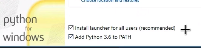

author: Sondre Halvorsen
id: nav-python-course
summary: This course is meant for programmers of some experience to get aquianted with Python.
status: draft
feedback link:

# Python Kurs | NAV

## About this Course
Duration: 5:00

This course will walk you through the basic concepts of Python, OOP with Python, Project Structure, io and finish with a practical Python project to tie the course material together.

### Python
Python is a clear and powerful object-oriented programming language, comparable to Perl, Ruby, Scheme, or Java.


Developed by Guido van Rossum


## Installation
Duration: 5:00

### Windows
 - Go to https://www.python.org/downloads/
 - Download the latest version of Python (as of this course being written Python 3.7.2)
 - Run the installer
  - enable PATH
 
 - click [Install now]

Test that Python is properly installed by running
```bash
python --version
```
in a CMD/Powershell shell.


### Mac

Same procedure as Windows but the command to be run in the terminal to check if Python has been correctly installed is:
```bash
python3 --version
```


## Table-Of-Contents

 There are several tools installed with the Python interpeter.


## Python a overview
Duration: 5:00

 - Python is strongly typed and dynamically typed.

 - Python is a general porpouse progragramming language. It is not the best choice for time critical or memory constrained tasks.

 - Python is really a compiled programming language, but it acts as a interpred language.

 - There exist different implementation of Python. The most common and the one we will use in this course will be CPython.


Python comes with "Batteries included", meaning Python comes with a feature rich standard libary.


## 2 and 3

Python has two main versions. Python 2 and Python 3. Python 3 is the newest, but it has struggeled with adoption for some time. Python 3 has now turned a corner and has of 2018 taken the mantle of the main version from Python 2.

Practicly this means that new Python packages and application will in most cases be written in Python 3. Python 2 end of life is january 1 2020.


## Zen of Python

The Python community has a highly opiniated view of "good" Python code.

The Zen of Python are the philosophical principles of Python [link](https://www.python.org/dev/peps/pep-0020/)

Beautiful is better than ugly.
Explicit is better than implicit.
Simple is better than complex.
Complex is better than complicated.
Flat is better than nested.
Sparse is better than dense.
Readability counts.
Special cases aren't special enough to break the rules.
Although practicality beats purity.
Errors should never pass silently.
Unless explicitly silenced.
In the face of ambiguity, refuse the temptation to guess.
There should be one-- and preferably only one --obvious way to do it.
Although that way may not be obvious at first unless you're Dutch.
Now is better than never.
Although never is often better than *right* now.
If the implementation is hard to explain, it's a bad idea.
If the implementation is easy to explain, it may be a good idea.
Namespaces are one honking great idea -- let's do more of those!

## Getting Started


## Strings

## Collections

## Modules


## Objects


## Exceptions


## Iterables

## Classes


## File io


## A Python Project