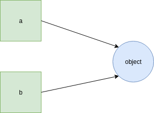

author: Sondre Halvorsen
id: nav-python-course
summary: This course is meant for programmers of some experience to get aquianted with Python.
status: draft
feedback link:

# Python Kurs | NAV

## About this Course
Duration: 5:00


This course will walk you through the basic concepts of Python, OOP with Python, Project Structure, io and finish with a practical Python project to tie the course material together.

### Python
Python is a clear and powerful object-oriented programming language, comparable to Perl, Ruby, Scheme, or Java.


Developed by Guido van Rossum


## Installation
Duration: 10:00

### Windows
 - Go to https://www.python.org/downloads/
 - Download the latest version of Python (as of this course being written: Python 3.7.2)
 - Run the installer
 - enable PATH
 
 - click [Install now]

Test that Python is properly installed by running
```bash
python --version
```
in a CMD/Powershell shell.
In case of errors reference the - Using Python on Windows page: [link](https://docs.python.org/3/using/windows.html)

### Linux

Ubuntu
```bash
sudo apt-get update
sudo apt-get install python3.7
python3 --version
```

### Mac

On macOS, the best way to install Python 3 is to use Homebrew. Not familiar with homebrew? [link](https://brew.sh/)

```bash
brew install python3
```


## Table-Of-Contents
Duration: 1:00

 There are several tools installed with the Python interpeter. Here are some of them:


| Tool      | Description  |
| ------------- |:-------------:|
| python interpreter     | The python interpreter. The executable that can be called directly from the commandline/terminal to start a new interactive python session (REPL) or to run python modules/files/packages |
| pip     | The Python package manager. The official Python package manager. Lets the user download and manage third-party packages hosted on the Python package index (PyPI)      | 
| IDLE | IDLE is Python’s Integrated Development and Learning Environment. Its a Python IDE for and by Python | 
| pydoc| The pydoc module automatically generates documentation from Python modules. | 


## Development Tools

Python can be used and developed with using only a basic text editor and the python interpreter. But for larger and more complex projects there is a benefit to use porpouse built tools for Python development.

#### Pycharm
Maybe the best Python IDE today [link](https://www.jetbrains.com/pycharm/)


## Python a overview
Duration: 2:00


Objects are Python’s abstraction for data. All data in a Python program is represented by objects or by relations between objects.

 - Python is strongly typed and dynamically typed.

 - Python is a general porpouse progragramming language. It is not the best choice for time critical or memory constrained tasks.

 - Python is really a compiled programming language, but it acts as a interpred language.

 - There exist different implementation of Python. The most common, and the one we will use in this course is CPython.

 - Python comes with "Batteries included", meaning Python comes with a feature rich standard libary.


## Python 2 and Python 3
Duration: 1:00

Python has two main versions. Python 2 and Python 3. Python 3 is the newest, but it has struggeled with adoption for some time. Python 3 has as of 2018 taken the mantle as the main version from Python 2.

Practicly this means that new Python packages and application will in most cases be written in Python 3. 

### Python 2 end of life is january 1 2020.


## Python Objects and Types

In a typical Python program there is alot less dumb grunt work than in program implemented in other languages. Python provides powerful object types built into the language. There is less of a need to code up serveral functions and classes to get only the basic functionality.

#### If you can, you should always use Python´s built-in types

| Object Type     | Example  |
| ------------- |:-------------:|
| Numbers     | 12 , 343.34 , Decimal() |
| Strings    | "sauna", 'python' | 
| Lists| [1, "two, [ 4, 5] ]| 
| Dictonaries | {"breakfast": "eggs", "number": 1, "nested": {1: "element"}} | 
| Tuples | (1, "bacon", 13.2, ["data", 1]) | 
| Sets | set("aaaa") -> {"a"}| 
| Booleans| True, False | 
| NoneType | None | 


## Python and Dynamic Typing

 - Python uses dynamic typing. Meaning we do not specify types in advance.
 - Python uses strong typing. Python does not try to coerce types to match


Java

```java

int myInt = 5;

```

Python

```python

my_int  = 5

```

In Python, types are determined automatically at runtime, not in response to declarations in code.
#### This means this is possible in Python

```python

my_var = 1

my_var += 1 # 2

my_var = "hello"

my_var += " friend" # hello friend"

```

Under the hood Python uses types, but these types live in the objects you create. Not in the references to them.


## Getting Started
Duration: 10:00

### REPL
The Python can be runned interactivly through the commandline. Running ```bash python``` in the commandline start a RELP (Read Evaluate Print Loop ) instance.

#### Example


#### Example of basic arithmetic in the REPL


#### Exit REPL
Windows: Ctrl + Z + Enter
Mac/Linux: Ctrl + D


### Python Standard Library

The Python Standard Library is large. Python follows a philosophy of; "Batteries included". Python is ready to go out of the box with modules to do a vast array of tasks.

#### Importing Modules Template

```python

import module_name

from module_name import function_name

import module_name as alias

from module_name import function_name as alias

```

#### Example with the math module

```python

import math # import only the module

result = math.factorial(2)

from math import factorial # import the factorial function from the math module
result = factorial(2)

```


#### The built-in function help() will provide description of provided module
```python

help(module_name)

```


## Python Built-in Functions

The Python interpreter has a number of functions and types built into it that are always available.
The full list of Python 3 built-in functions can be found here: [link](https://docs.python.org/3/library/functions.html)

### Important Built-in Functions

```python

len() # Return the length (the number of items) of an object. 

input() # The function then reads a line from input, converts it to a string

print() # Prints to stdout

bool() # returns the True or False 

help() # Invoke the built-in help system. (This function is intended for interactive use(REPL).)


```


## Fundemental Built-in Types
Duration: 5:00

Scalar types and values

- integers   [5]
- floats     [23.2]
- NoneType   [None]
- bool       [True/False]

### int
unlimited precision signed integer

```python

my_int = 1

my_new_int = int(22.22) # 22

from_str_int = int("456") # 456

```


### float

```python

my_float = 323.12

my_next_float = 3e8

my_third_float = 1.7e-35
```


### None
None is the only value of the NoneType. It is most often used to represent the absence of a value.

```python

nothing = None

```


### bool

```python
sant = True
usant = False

bool(sant) # returns True

bool(1) # returns True

bool(0) # returns False

```

#### Different Types in Python have different "truthy" and "falsy" values

```python

bool([]) # returns False, empty list is falsy

bool([1,2,10]) # returns True, not-empty list is truthy


```

## Python Program Structure Flexibility
Duration: 5:00

Python can be used as a interactive calculator, a scripting language,  to build web applications, to create machine learning models and the list goes on.

To facilitate such broad usescope Python has several different "Structures" to execute Python code in. One of the amazing things with Python is how easy it is to get started with a small script, maybe only to test a small idea or a new module. At the same time if you choose you can build solid structures and define clear abstractions in your program.

Here is a rough mental model for the different structures we write Python code in, and their strength/weaknesses.


## Python Whitespace
Duration: 5:00

The control structure statements in python use colon ( : ) to indicate termination of the statement.

After a colon ( : ) in a statement the body of the construct should follow. This block of code should be indented.

By convention this indentation level is 4 spaces.

; at the end of statements are not needed.

```python
if var1 == var2:
    dosomething() # Note 4 space indentation

if var1 == var2:
dosomething() # Indentation ERROR

```

Every new indentation level defines a new block

```python
if var1 == var2:
    dosomething()

    if var1 is True:
        dosomethingmore()

```
In languages like Java &&, ||, ! are used for and, or, not.
In Python we just use those words instead:

```python

if expr or expr2:
    dosomething()


if expr and expr2:
    dosomethingelse()

if not expr:
    dothatthing()


```


For not equal you can use !=

```python

if expr != expr2:
    dothatthing()

```

Indentation levels in Python code matches the structure of the program.

### Significant whitespace Pros
1. Forces the writer to write readable code
2. Less clutter
3. Human and Computer stays in sync


### Whitespace rules
1. Prefer four spaces
2. Never mix spaces and tabs
3. Be consistent on consecutive lines
4. Only deviate to improve readability


## Python Culture
Duration: 3:00

Python has a large and very opinionated community. Writing Python code that follows the community standards is recognised as writing pythonic code.

Development of the Python language is managed through PEPs (Python Enhancement Proposals)

### Notable PEPs

 - PEP 8 - Style Guide for Python Code [link](https://www.python.org/dev/peps/pep-0008/)
 - PEP 20 - The Zen of Python [link](https://www.python.org/dev/peps/pep-0020/)


Accessing Zen of Python within Python itself
```python
import this
```

```
Beautiful is better than ugly.
Explicit is better than implicit.
Simple is better than complex.
Complex is better than complicated.
Flat is better than nested.
Sparse is better than dense.
Readability counts.
Special cases aren't special enough to break the rules.
Although practicality beats purity.
Errors should never pass silently.
Unless explicitly silenced.
In the face of ambiguity, refuse the temptation to guess.
There should be one-- and preferably only one --obvious way to do it.
Although that way may not be obvious at first unless you're Dutch.
Now is better than never.
Although never is often better than *right* now.
If the implementation is hard to explain, it's a bad idea.
If the implementation is easy to explain, it may be a good idea.
Namespaces are one honking great idea -- let's do more of those!
```

## Python Naming

According to PEP 8 Python programs should follow the following style:


#### Class Names

```python
class CamelCaseClassNames:
    pass
```

#### Function Names

```python
def snake_case_functions():
    pass
```

#### Module and Package Names
Modules should have short, all-lowercase names. Underscores can be used in the module name if it improves readability
```
my_module
```

#### Python private variables/functions/methods

Python does not have a built-in concept of "private".

The underscore prefix is meant as a hint to another programmer that a variable, function or method starting with a single underscore is intended for internal use. This convention is defined in PEP 8.

#### Example

```python

my_int = 1 # integer intended for public use

_my_int = 1 # integer not inteded for public use

def public_function():
    pass

def _private_function():
    pass

```


## Control Structures
Duration: 3:00

## Conditional Statements

#### Template
```python

if expr:
    print("expr is True")

```

#### Example

```python

if True:
    print("true!") # will be printed

if False:
    print("false") # will not be printed

```


Python will implicitly convert expresions to a bool value. Both of the print() statements in the block under will execute
```python

if bool("yay"):
    print("yoo")

if "yay":
    print("yoo")

```

#### If Else

```python

if 30 < 10:
    print("30 is smaller than 10")
else:
    print("30 is bigger than 10")

```


## While Loops
Duration: 3:00


#### Template
```python

while expr:
    print("looping while expr is true")

```


#### Example

Print and decrement
```python
abc = 10

while abc != 0:
    print(abc)
    abc -= 1

```

Infinite loop

```python
abc = 10

while True
    print(abc)
    abc -= 1

```

#### break

break statement terminates the loop and transfers execution to the first statement after the loop.

```python

while True:
    if expr:
        break
print("this will be printed after break")

```


---

## For Loops
Duration: 3:00

for-loops in Python are really what is called foreach loops in language like Java

for-loops iterate over iterables, item by item.
#### Template
```python

for item in iterable: 
    dosomething(item)

```


#### Examples

```python
for number in range(10):
    print(number) 


```


## Strings
Duration: 8:00

Python String has the type of ```str ```

Definition of  ```str ```: Immutable sequences of Unicode codepoints
NOTE: Default encoding for Python strings are utf-8


#### String Literals
```python

"this is a string" # doblequote

'this is also a string' # singlequoute


" string with single quoute 'inside' " # doublequote with singlequote inside

' string with single quoute "inside" ' # singlequote with doublequote inside

' string with escaped singlequote \' ! ' # escape singlequote

"this will result in error' # single and double quote

```

#### Assignment

```python

string_variable = "string"

```


#### Multiline Strings

```python

""" This is
    a really long
    string! """

```


The str type has a corresponding str() function to get the str representation of the object.

#### Template

```python

my_string = str(variable)

```

#### Example
```python

string_int = str(456) # "456"

string_bool = str(True) # "True"

```


### More about Python Strings

Characters in a string can be looped over like a sequence

```python

my_string = "ABCD"

# This loop will print A B C D
for ch in my_string:
    print(ch)

```

Characters in a string can be indexed like a sequence

```python

my_string = "ABCD"

# This loop will print A B C D
for i in range(len(my_string)):
    print(my_string[i])

```


## Excercise - Strings
Duration: 10:00

Create a script that
 1. Prints the alphabet
 2. Prints every even numbered character
 3. Prints every odd numbered character


## Collections


## Lists
Duration: 10:00

Python lists are the workhorse of the Python data structures. It is a mutable sequence of objects. Note that a list can contain different data types, but creating and using lists containing different types would be considered bad practice.

Python lists have the type ```list```


#### Template

```python
my_list = [] # create a empty list

also_my_list = list() # create a empty list with the list function

cool_list = ["Some", "Data", "Items"]


```


#### Lists can be looped over

```python 

my_list = [1, 2, 4, 1, 9]

sum = 0
for num in my_list:
    sum += num

print(sum) # 17


```


### Lists items can be accessed by index

```python
my_list = ["I", "am", "having", "fun"]

element= my_list[3]

print(element) # fun

```

### Lists can be changed by index 

```python
my_list = ["I", "am", "having", "fun"]

my_list[3] = "a blast"

print(my_list) # ['I', 'am', 'having', 'a blast']

```

### Appending to lists

```python
my_list = [1, 2, 3, 4]

my_list.append("Mhhh this might cause some confusion for people using my code")

print(my_list) # [1, 2, 3, 4, 'Mhhh this might cause some confusion for people using my code']

```

## Tuples
Duration: 2:00

Tuples work like lists, except that elements in tuples cannot change place. Tuples are immutable. After a tuple has been created, the length of the tuple cannot change.

#### Definition: A Tuple is a ordered collection of arbitrary Python objects

#### Example

```python

# create tuple
my_tuple = (1, 2, 3, 4)


#access contents
element = my_tuple[1]


```


#### In Action

```python


new_tuple = (1, 2) + (3 ,4) # (1 , 2, 3 , 4)

trippeled_tuple = (1, 2) * 3 # (1, 2, 1, 2, 1, 2)

```


To create a tuple with only one element, leave a trailing ,

```python

only_int = (1) # 1

tuple_with_int = (1,) # (1, )

```

## Dictonaries
Duration: 10:00

Python dictionaries are mutable mappings of keys to values. Dictionaries are fundemental to Python and many internal structures in the Python runtime are implemented using dictonaries.

Python dictionaries have the type ```dict```


### Creating Dicts

#### Template
Dictionaries can be created by placing a comma-separated list of key: value pairs within braces, for example: ```{'jack': 4098, 'sjoerd': 4127}``` or ```{4098: 'jack', 4127: 'sjoerd'}```, or by the dict constructor ```dict()```.

```python
{key1: value1, key2: value2}
```

A dictionary’s keys are almost arbitrary values. Values that are not hashable, that is, values containing lists, dictionaries or other mutable types (that are compared by value rather than by object identity) may not be used as keys

#### Examples

```python

locations = {"Sondre": "Oslo", "Grandpa": "heaven"}

phone_book = {"girlfriend": 90392939, "pizza_shop": 12321291}

```

### Accessing Dicts

```python

locations = {"Sondre": "Oslo", "Grandpa": "heaven"}
sondres_location = locations["Sondre"]

print(sondres_location) # Oslo


```


### Appending

```python

phone_book = {"girlfriend": 90392939, "pizza_shop": 12321291}

phone_book["fish_tacos"] = 22310943

phone_book[1230924] = "Whoopsi this might be a mistake, but it is valid Python code"


print(phone_book) # {'girlfriend': 90392939, 'pizza_shop': 12321291, 'fish_tacos': 22310943, 1230924: 'Whoopsi this might be a mistake, but it is valid Python code'}

```

### Dict Methods
For the full list of dict methods: [link](https://docs.python.org/3/library/stdtypes.html?highlight=dictionary#dict)


##### items()
Get the dict items. Returns all the key, value pair as a list of tuples
```python

my_dict = {1: "a", 2: "b", 3: "c"}

print(my_dict.items()) # [(1, 'a'), (2, 'b'), (3, 'c')]

```


##### keys()
Returns all the keys in the dict as a list
```python

my_dict = {1: "a", 2: "b", 3: "c"}

print(my_dict.keys()) # [1, 2, 3]

```

##### values()
Returns all the values in the dict as a list
```python

my_dict = {1: "a", 2: "b", 3: "c"}

print(my_dict.values()) # ["a", "b", "c"]

```

## Modularity
Duration: 3:00

If you want to write a somewhat longer program, you are better off writing code in files, known as creating a script. As your program gets longer, you may want to split it into several files for easier maintenance. You may also want to use a handy function that you’ve written in several programs without copying its definition into each program.
 
To support this, Python has a way to put definitions in a file and use them in a script. Such a file is called a module; definitions from a module can be imported into other modules or into the main module (The file executed first by the python interpreter eks: ```python main.py```).
 
A module is a file containing Python definitions and statements. The file name is the module name with the suffix .py


#### During the next steps of the course we will write a small Python program for fetching data from the internett.


## Starting a new project
Duration: 2:00

To start a new Python project

 1. Create a new folder with the project name:
    ```bash
    mkdir python-course-project
    ```
 2. Create a new python script file in the project directory:
    ```bash
    cd python-course-project
    touch web_reader.py
    ```

Now we are ready to start writting a Python script

## Writting our first Python module
Duration: 5:00

Open the web_reader.py in you preferred Python editor


Copy and paste:
```python
from urllib import request


with request.urlopen("https://gist.githubusercontent.com/sonhal/db9c2f7869c6937bdfed009c5381f2de/raw/a63d7b16a14247e13ddebfe4f064a2987b3ae011/python_course_data.txt") as file:
    words = file.read().decode("utf-8").split()

    numbers_in_the_text = []
    for word in words:
        if word.isdigit():
            int_word = int(word)
            numbers_in_the_text.append(int_word)
    print(numbers_in_the_text)
```
There is a bug in the code, but we will ignore it for now (did you catch it?)


Now lest execute it

```bash
python3 web_reader.py
```

The result printed to the terminal should be:
```bash
[1, 456]
```

## Exercise - Modules
Duration: 5:00

Change the code python code in web_reader.py to print out every word in the result from the url.

What does the text contain?


## Creating Functions
Duration: 10:00

If you try to import the web_reader module. Either into a REPL instance or into another module you will quickly realise that the code in the module is run immediately. Thats not very flexible!
To make our code more flexible by giving the users of our module the opprotunity to descide when and what kind of functionality they would like to use we define a function.


### Python Functions


### Defining Functions

#### Template
```python

def my_function(parameter1, parameter2):
    """ Codeblock """

```


#### Example

```python

def add(a, b):
    return a + b

```


##### Void functions in Python does not need any special syntax

```python

def funny_print(text):
    print(f"HaHaHa {text}") # Note the f"" string syntax

```
Functions that does not return explicitly returns None

### Using Functions


Normal argument passing
```python


my_funny_joke = "boogers"
funny_print(my_funny_joke)

```

Passing as keyword argument
```python

my_funny_joke = "boogers"
funny_print(text=my_funny_joke) # more readable perhaps

```

## Python Default Arguments
Duration: 5:00

Python functions can be defined with default arguments. That is arguments that are optional and will default to a specified value if the argument is not added by the caller of the function.


#### Template
```python

def function_name(param=default):
    ...

```

#### Example

```python

def decode_str(encoding="utf-8"):
    ...

```


```python

# Define function
def say_meow(times=1):
    """ Function that prints 'Meow!' """

    for _ in range(times):
        print("Meow!")


# Use function

say_meow() # Meow!

say_meow(2) # Meow! Meow!


```


#### NB: Do not use mutable variables as default values


## Exercise - Functions
Duration: 5:00

Refactor the web_reader module.

Wrap the code in a function named ```nav_facts```
The function should not take any arguments


## A Python Module
Duration: 5:00

Here is an example of a more feature rich web_reader module.
The ```""" """``` block under the function signature is called a docstring and documents the function.

```python
from urllib import request
from collections.abc import Sequence

# -> says this function returns None
def print_nav_facts() -> None:
    """
    Prints facts about NAV
    :return: None
    """
    url = "https://gist.githubusercontent.com/sonhal/db9c2f7869c6937bdfed009c5381f2de/raw/a63d7b16a14247e13ddebfe4f064a2987b3ae011/python_course_data.txt"
    words = read_from_url(url=url)
    for word in words:
        print(word)

# -> says this function returns a Sequence
def read_from_url(url: str) -> Sequence:
    """
    :param url: str with url to resource
    :return: list of returned data split by space
    """
    with request.urlopen(url) as file:
        words = file.read().decode("utf-8").split()
        return words

```
Note the type annotations in these functions

-> indicates that the function returns the type that follows

parameters in functions can be type annotated as so:

```python
def func(param1: int, param2: str):
    pass # pass gives us the opporotunity to mock up functions

```

Type anotations in Python are purely for documentation and static code analysis tools, like type hinting in IDEs

## Python Special Attributes
Duration: 5:00

In the Python runtime every element is an object.

Every object has an identity, a type and a value. An object’s identity never changes once it has been created; you may think of it as the object’s address in memory.

Modules in Python are also object, and as sutch have attributes we can access. attributes in Python that are named with double underscores```__attribute__``` are called Special Attributes.

Once such special attribute is: ```__name__````

The ```__name__``` attribute lets our module discover if it has been imported into another module or if it has been run as main.

#### Example
Add the following to the bottom of ``` web_reader.py ````

```python

if __name__ == "__main__":
    print_nav_facts()

```

Run the script with:

```bash

python3 web_reader.py

```

Now we can  import the web_reader module without having the code excetute and we can still execute the code from the commandline

#### Commandline Arguments

passing arguments to our program is a good way to make more usable scripts. Python provides direct access to the passed arguments and a package for more sophisticated CLI applications


#### Basic Python commandline argument accessing
```python

import sys


if __name__ == "__main__":
    first_cli_argument = sys.argv[1] # sys.argv[0] is the module python is executing


```

#### Advanced Python CLI argument handling

```python
import argparse

parser = argparse.ArgumentParser(description='Process some integers.')

parser.add_argument('integers', metavar='N', type=int, nargs='+',
                    help='an integer for the accumulator')

args = parser.parse_args()
print(args.accumulate(args.integers))


```


## Python module/script/program
Duration: 1:00

| Concept     | Description  |
| ------------- |:-------------:|
| Python Module    | Convenient import with API |
| Python Script     | Convenient execution from command line | 
| Python Program | Generally composed of several modules | 


## Objects
Duration: 10:00

#### Garbage Collector

Python is garbage collected. When every reference to a object goes out of scope the object gets garbage collected.


#### Variables and References
Python does not really have the samme variables as other languages like C++ or Java. In Python all variables are named references to objects.

 - Assignment attaches a name to an object
 - Assigning from one reference to another puts two name tags on the same object.



#### Example

```python
a = 5

b = 3

id(a) # returns the indentity of the object
id(b) 

a is b # False

a = b

a is b # True, a now points to the same int object as b
```

 - The ```is``` operator determines equality of identity
 - Use ```==``` to test for equivalence

#### Example

```python
b = [2,3]

a = b # a now points to the same list object as b

a is b # True, a and b points to the same object

a == b # True, a and b point to the same object and that object is of course equivalent with itself

a = [2,3] # assign a to a new list object containing the same values as b

a is b # False, a and b points to different list objects

a == b # True, a and b's list objects are equivalent


```

#### Note that Python only passes by object reference to functions and methods.


## Exceptions

#### Repetition

- Raise and exception to interrupt program flow

- Handle an exception to resuime control

- Unhandled exceptions will terminate the program

- Exceptions objects contain information about the exceptional event


Python and Java exceptions are similar.


#### Template
```python

try:
    # code that might throw an exception
except ExceptionType:
    # handle exception

```


## Exceptions because of programmer errors

 - IndentationError
    The indentation of your code does not conform to Python standards

- SyntaxError

- NameError


You can get a reference to the Exception object by assignmet in the except clause.


```python
try:
    # code that might throw exceptions
except ValueError as err:
    print(err)


```


If we want we can log the error and re-raise the error.

```python

try:
    # code that might throw exceptions
except TypeError as err:
    print(f"TypeError: {err}")
    raise # raise the TypeError again

```


We can ensure that a code block always is run after an exception with ```finally```


```python

try:
    # code that might throw exceptions
except Exception as err:
    pass
finally:
    print("I will always be ran!")

```

## Python and TypeErrors

In Python we commonly do not try to protect against TypeErrors.

#### Example of type checking
```python

def convert_to_int(var):
    if not isinstance(var, str):
        raise TypeError("var argument must be a string")
    return int(var)

```
This is regarded as bad Python code.


Python is a dynamically typed language, embrace that!


## Iterables

In Python any object can be iterate over as long as it implements the ```__iter__``` magic method.

```python

class SchoolBus:

    def __init__(self, *students):
        self._students = list(students)
    
    def __iter__(self):
        return iter(self._students)

# Create Schoolbus with two students
sb = SchoolBus("Mike", "Fred")

# loop over the SchoolBus object 
for student in sb:
    print(student) # Mike Fred

```


## Comprehensions

Comprehensions is a method of defining container data-structures, like lists, dicts and sets in a declarative manner.


### Types of Comprehensions

- list comprehensions
- set comprehensions
- dictionary comprehensions

### Pros
 - Comprehensions are widely used in the Python community. 
 
 - Readable

 - Faster

 - Expressive


## List Comprehensions
### Template

```python

[expr(item) for intem in iterable]

```


### Example

```python

words = " Hello I am learning a new Python concept".split() # ["Hello", "I", "am", "learning", "a", "new", "Python", "concept"]

word_length = [len(word) for word in words] # [5, 1, 2, 8, 1, 3, 6, 7]

```

## Dictionary Comprehensions

#### Template
We have to call .items() since iteration directly on a dict object only yields the keys.
```python

dict_variable = {key:value for (key,value) in dictonary.items()}

```


#### Example

Lets reverse the switch key and value with a comprehension
```python
name_and_age = {"Mike": 20, "Monica": 30, "Lars": 43}

age_and_name = {value:key for (key, value) in name_and_age.items()}

```


## Python Classes

In Python as we have seen it is not necessary to create classes to structure our code. Create classes to hold our code and data will in many cases be regarded as bad practice by seasoned pythonistas. Python is a flexible language. It is up to the writer to decide what level of structure and abstraction the code needs. 

The convention is to use CammelCase for Python class names.

#### Template

```python 

class ClassName:
    pass


```


In Python the constructor is handled by the language. Python instead exposes the  __int__() method. For all practical purposes the __init__() method can be thought of like a contructor.

```python


class ClassName:

    def __init__(arg1, arg2):
        pass


```

## Magic Methods
Duration: 5:00

Python’s classes are famous for their magic methods , commonly called dunder (double underscore) methods. 

they are named in the same way:

```python

__methodname__

```

Most used of them is the ```__init__``` method, used for class instansiation. They're special methods that you can define to add "magic" to your classes. 

### Here are some commonly used magic methods


### str
Defines behavior for when str() is called on an instance of your class.

```python

__str__(self)

```


##### Example

```python
class PrintableClass:

     def __init(self, name: str):
        self.name = name
    

    def __str__(self):
        return f"PrintableClass(name={self.name})"

```


### repr
Defines behavior for when repr() is called on an instance of your class. The major difference between str() and repr() is intended audience. repr() is intended to produce output that is mostly machine-readable (in many cases, it could be valid Python code even), whereas str() is intended to be human-readable.
```python

__repr__(self)

```


### len
Returns the length of the container. Part of the protocol for both immutable and mutable containers.
```python

__len__(self)

```


##### Example

```python

class SchoolBus:

    def __init__(self, *students):
        self._students = list(students)

    
    def __len__(self):
        return len(self._students)


school_bus = SchoolBus("Carl", "Victoria", "Mike")

print(len(school_bus)) # 3

```


##### Read more about Python magic methods here
[link](https://rszalski.github.io/magicmethods/)


## Extra About Python Classes


#### NOTE:
 - Python <b>does not</b> have a keyword for interfaces
 - Python <b>does</b> have multiple inheritance

The most common use of multiple inheritance in Python is "Mixin" classes. Classes that provide extra functionality through inheritance. Example: LoggingMixin, AuthenticationMixin.

```python

class MyFunClass(CoolMixin, EvenCoolerMixin):
    pass

 ```


## Instance & Class variables
Most beginners and even some advanced Python programmers do not understand the distinction between instance and class variables. Their lack of understanding forces them to use these different types of variables incorrectly. Let’s understand them.

The basic difference is:

 - Instance variables are for data which is unique to every object
 - Class variables are for data shared between different instances of a class


```python

class Cal:
    # pi is a class variable
    pi = 3.142

    def __init__(self, radius):
        # self.radius is an instance variable
        self.radius = radius

    def area(self):
        return self.pi * (self.radius ** 2)
```

## Exercise - Classes
Duration: 10:00

#### Create a NAVKontor class
The class should have

 - a constructor that takes the arguments ```name: str``` and ```num_employees: int```
 - a method ```get_in_line(user:str)``` that takes a user name and adds them to the line ( you have to build the internal datastucture to handle this)
 - a method ```get_line()``` which returns a tuple with the users in the line.
 - __str__ and __repl__ to reflect the class


## Files and Resources
Duration: 10:00

Python comes with a built-in open function.

```python
open()
```

It takes the following arguments:

 - file: path to the file (required)
 - mode: read/write/append, binary/text
 - encoding: text encoding


 Python handles opened files in two modes:
  - Binary: Raw data
  - Text: strings of str type

In the case you do not specify an encoding, Python will choose a default based on the contents of:

```python
import sys
sys.getdefaultencoding()
```

## Writing to File

| Character     | Meaning            |
| ------------- |:-----------:|
| <b>Character</b>     | <b>Meaning</b>           |
| 'r'           | open for reading (default) | 
| 'w'           | open for writing, truncating the file first | 
| 'x'           | open for exclusive creation, failing if the file already exists |
| 'a'           | open for writing, appending to the end of the file if it exists |
| 'b'           | binary mode |
| 't'           | text mode (default) |
| '+'           | open a disk file for updating (reading and writing) |
| 'U'           | [universal newlines](https://docs.python.org/3/glossary.html#term-universal-newlines) mode (deprecated) |


The default mode is 'r' (open for reading text, synonym of 'rt').


#### Writting single lines
```python

f = open("cool_text", mode="wt", encoding="utf-8")

f.write("Python courses are the best!\n")
f.write("It is so much fun!")

f.close()


```

#### Writting multiple lines

```python

f = open("cool_text", mode="wt", encoding="utf-8")

f.writelines(["Python courses are the best!\n", 
              "It is so much fun!"])

f.close()


```


## Reading from File
Duration: 5:00

### Basic read
```python
of = open("cool_text", mode="rt", encoding="utf-8")
cool_string = of.read()

print(cool_string) # "Python courses are the best!\nIt is so much fun!"

```

### Read a line
```python
of = open("cool_text", mode="rt", encoding="utf-8")
cool_string = of.readline()
of.close()

print(cool_string) # "Python courses are the best!\n" 

```


### Read lines
```python
of = open("cool_text", mode="rt", encoding="utf-8")
cool_strings = of.readlines()
of.close()

print(cool_strings) # ["Python courses are the best!\n"], ["It is so much fun!"] 

```

## Files as Iterators

File objects implement the iterator protocol ```__iter__```

We can iterate over a file object like so:

```python

def file_printer(filename):
    f = open(filename, mode="rt", encoding="utf-8")
    for line in f:
        print(line)
    f.close()


```

## A Python Project
Duration: 10:00

Just as Code Style, API Design, and Automation are essential for a healthy development cycle, Repository structure is a crucial part of your project's architecture.

### Template Python Project

```
README.rst
LICENSE
setup.py
requirements.txt
sample/__init__.py
sample/core.py
sample/helpers.py
docs/index.md
tests/test_basic.py
tests/test_advanced.py

```
#### Project Module
 Replace ```sample``` with the name of the project. The ```sample/``` directory is the location of the python code for the project.

#### Licence

This is arguably the most important part of your repository, aside from the source code itself. The full license text and copyright claims should exist in this file.

#### Setup.py
 - Location: ./setup.py 
 - Purpose:  Package and distribution management.
If the project is meant to be used as a package you should provide a setup.py file that will handle installation of your package.

More about setup.py here [link](https://packaging.python.org/tutorials/packaging-projects/)


#### Requirements File
 - Location: ./requirements.txt 
 - Purpose:  Development dependencies.
A Pip requirements file should be placed at the root of the repository. It should specify the dependencies required to contribute to the project: testing, building, and generating documentation.

If your project has no development dependencies, or you prefer development environment setup via setup.py, this file may be unnecessary.

#### Documentation
 - Location: ./docs/ 
 - Purpose:  Package reference documentation.

#### Test Suite
 - Location: ./test_sample.py or ./tests 
 - Purpose:  Package integration and unit tests.
Starting out, a small test suite will often exist in a single file:

./test_sample.py


## Testing Python Code
Duration: 10:00

Testing code is good, we should all write test for our code. Python comes with a unittest module in the standard libary.

the unittest module. Contorary to it's name can be used for:

- unit tests
- integration tests
- acceptance tests


#### Concepts

- TestCase
    groups togheter related tests functions. The basic unit of thest organization in unittest

- Fixtures
    code that runs before and/or after each test function. Sets up and tears down the testing environment.

- Assertions
  specific tests for condition and behaviors


## Unittest

####Example
Lets say we have the following function, that returns every element in a iterable object that has a even numbered index.

```python

def get_even_indexed(iterable):
    return iterable[::2] 


```


We can then write a unittest for the function in this manner:


```python
import unittest


class GetEvenIndexedElementsTest(unittest.TestCase):

    def setUp(self):
        """ Fixture for setting up variables for the tests to use"""
        self.normal_iterable = (0, 1, 2, 3, 4, 5, 6)

    def test_function_runs(self):
        """Basic test to see that the function runs"""
        get_even_indexed(self.normal_iterable)

    def test_function_return_count(self):
        """ Check that the result count is correct"""
        result = get_even_indexed(self.normal_iterable)
        self.assertEqual(len(result), 4)


```

## Python EAFP vs LBYL
Duration: 5:00

One idiomatic practice in Python that often surprises people coming from programming languages where exceptions are considered, well, exceptional, is EAFP: "it's easier to ask for forgiveness than permission". Quickly, EAFP means that you should just do what you expect to work and if an exception might be thrown from the operation then catch it and deal with that fact.

 What people are traditionally used to is LBYL: "look before you leap". Compared to EAFP, LBYL is when you first check whether something will succeed and only proceed if you know it will work.

#### LBYL
```python

if "key" in dict_:
    value += dict_["key"]

```

#### EAFP
```python

try:
    value += dict_["key"]
except KeyError:
    pass

```

Some people are going to read this and say that the EAFP version is longer and explicit compared to the LBYL, which is obviously true. But the idea that "explicit is better than implicit" is a key guideline in the design of Python itself, and so the explicitness of the code is on purpose.

## Python Virtual Environments
Duration: 5:00

#### Problem
Python applications will often use packages and modules that don’t come as part of the standard library. Applications will sometimes need a specific version of a library.

This means it may not be possible for one Python installation to meet the requirements of every application. If application A needs version 1.0 of a particular module but application B needs version 2.0, then the requirements are in conflict and installing either version 1.0 or 2.0 will leave one application unable to run.

#### Solution

The solution for this problem is to create a virtual environment, a self-contained directory tree that contains a Python installation for a particular version of Python, plus a number of additional packages.

Different applications can then use different virtual environments. To resolve the earlier example of conflicting requirements, application A can have its own virtual environment with version 1.0 installed while application B has another virtual environment with version 2.0. If application B requires a library be upgraded to version 3.0, this will not affect application A’s environment.


## Creating Virtual Environments
Duration: 5:00

The module used to create and manage virtual environments is called ```venv```

From the commandline

```bash
python3 -m venv env_name
```

This will create the ```env_name```directory if it doesn’t exist, and also create directories inside it containing a copy of the Python interpreter, the standard library, and various supporting files.


On Windows, run:
```bash
env_name\Scripts\activate.bat
```

On Unix or MacOS, run:
```bash
source env_name/bin/activate
```


To deactive
```bash
deactivate
```

## Pip
Duration: 5:00

You can install, upgrade, and remove packages using a program called ```pip```. By default pip will install packages from the Python Package Index, (https://pypi.org)[https://pypi.org]


### Managing Packages with pip

pip has a number of subcommands: “search”, “install”, “uninstall”, “freeze”, etc. See [Installing Python Modules](https://docs.python.org/3/installing/index.html#installing-index)


#### Installing Packages

command template
```bash
pip install package_name
```

You can specify package version directly in the commandline

command example
```bash
pip install requests==2.6.0
```

## The Project

To exercise our new Python skills I will leave you with a small challenge!

### Python UIO courses descriptions

Create a small Python program that can be called from the commandline. The programs porpouse is to give the user the description of UiO (Universitetet i Oslo) study courses.

#### The program will take a course name as a argument from the commandline

#### Example
```python3 -m description.py informatikk```

The program should print to the terminal the following information:

```Ønsker du ekstra kompetanse innen informatikk eller en bredere forståelse for faget? Da er dette årsenheten for deg, uavhengig av bakgrunn og arbeidsområde.``

To complete the task it is recommended to read about the following python packages:

 - BeautifulSoup [link](https://www.crummy.com/software/BeautifulSoup/bs4/doc/#)
 - Requests [link](http://docs.python-requests.org/en/master/)


Build a webscraper with Python tutorial  [link](https://towardsdatascience.com/building-a-web-scraper-in-python-fb8f48597ec3)
