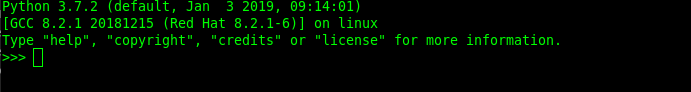
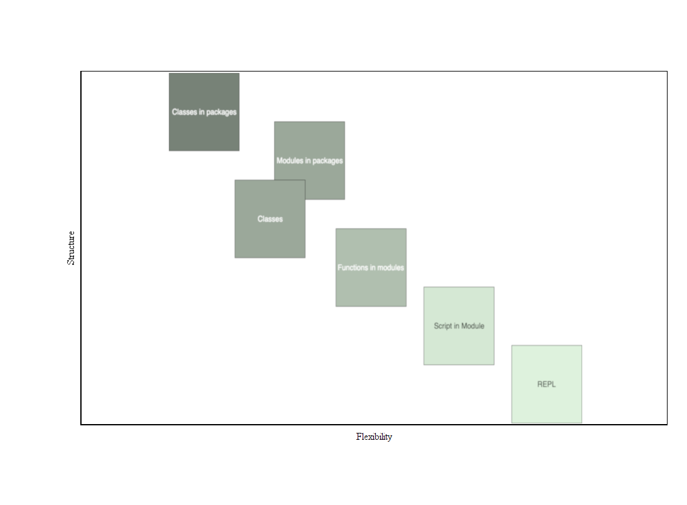

author: Sondre Halvorsen
id: nav-python-course
summary: This course is meant for programmers of some experience to get aquianted with Python.
status: draft
feedback link:

# Python Kurs | NAV

## About this Course
Duration: 5:00


This course will walk you through the basic concepts of Python, OOP with Python, Project Structure, io and finish with a practical Python project to tie the course material together.

### Python
Python is a clear and powerful object-oriented programming language, comparable to Perl, Ruby, Scheme, or Java.


Developed by Guido van Rossum


## Installation
Duration: 10:00

### Windows
 - Go to https://www.python.org/downloads/
 - Download the latest version of Python (as of this course being written: Python 3.7.2)
 - Run the installer
 - enable PATH
 
 - click [Install now]

Test that Python is properly installed by running
```bash
python --version
```
in a CMD/Powershell shell.
In case of errors reference the - Using Python on Windows page: [link](https://docs.python.org/3/using/windows.html)

### Linux

Ubuntu
```bash
sudo apt-get update
sudo apt-get install python3.7
python3 --version
```

### Mac

On macOS, the best way to install Python 3 is to use Homebrew. Not familiar with homebrew? [link](https://brew.sh/)

```bash
brew install python3
```


## Table-Of-Contents
Duration: 1:00

 There are several tools installed with the Python interpeter. Here are some of them:


| Tool      | Description  |
| ------------- |:-------------:|
| python interpreter     | The python interpreter. The executable that can be called directly from the commandline/terminal to start a new interactive python session (REPL) or to run python modules/files/packages |
| pip     | The Python package manager. The official Python package manager. Lets the user download and manage third-party packages hosted on the Python package index (PyPI)      | 
| IDLE | IDLE is Python’s Integrated Development and Learning Environment. Its a Python IDE for and by Python | 
| pydoc| The pydoc module automatically generates documentation from Python modules. | 


## Python a overview
Duration: 2:00

Objects are Python’s abstraction for data. All data in a Python program is represented by objects or by relations between objects. (In a sense, and in conformance to Von Neumann’s model of a “stored program computer,” code is also represented by objects.)

 - Python is strongly typed and dynamically typed.

 - Python is a general porpouse progragramming language. It is not the best choice for time critical or memory constrained tasks.

 - Python is really a compiled programming language, but it acts as a interpred language.

 - There exist different implementation of Python. The most common and the one we will use in this course will be CPython.

 - Python comes with "Batteries included", meaning Python comes with a feature rich standard libary.


## Python 2 and Python 3
Duration: 1:00

Python has two main versions. Python 2 and Python 3. Python 3 is the newest, but it has struggeled with adoption for some time. Python 3 has now turned a corner and has of 2018 taken the mantle of the main version from Python 2. Practicly this means that new Python packages and application will in most cases be written in Python 3. 

### Python 2 end of life is january 1 2020.


## Getting Started
Duration: 10:00

### REPL
The Python can be runned interactivly through the commandline. Running ```bash python``` in the commandline start a RELP (Read Evaluate Print Loop ) instance.

#### Example


#### Example of basic arithmetic in the REPL


#### Exit REPL
Windows: Ctrl + Z + Enter
Mac/Linux: Ctrl + D


### Python Standard Library

The Python Standard Library is large. Python follows a philosophy of; "Batteries included". Python is ready to go out of the box with modules to do a vast array of tasks.

```python

import module_name

from module_name import function_name

import module_name as alias

from module_name import function_name as alias

```

Example with the math module

```python

import math # import only the module

result = math.factorial(2)

from math import factorial # import the factorial function from the math module
result = factorial(2)

```


#### The free function help() will provide description of provided module
```python

help(module_name)

```


## Python Built-in Functions

The Python interpreter has a number of functions and types built into it that are always available.
The full list of Python 3 built-in functions can be found here: [link](https://docs.python.org/3/library/functions.html)

### Important Built-in Functions

```python

len() # Return the length (the number of items) of an object. 

input() # The function then reads a line from input, converts it to a string

print() # Prints to stdout

bool() # returns True or False

help() # Invoke the built-in help system. (This function is intended for interactive use(REPL).)


```


## Fundemental Built-in Types
Duration: 5:00

Scalar types and values

- integers   [5]
- floats     [23.2]
- NoneType   [None]
- bool       [True/False]

### int
unlimited precision signed integer

```python

my_int = 1

my_new_int = int(22.22)

from_str_int = int("456")

```


### float

```python

my_float = 323.12

my_next_float = 3e8

my_third_float = 1.7e-35
```


### None
None is the only value of the NoneType. It is most often used to represent the absence of a value.

```python

nothing = None

```


### bool

```python
sant = True
usant = False

bool(sant) # returns True

bool(1) # returns True

bool(0) # returns False

```

#### Different Types in Python have different "truthy" and "falsy" values

```python

bool([]) # returns False, empty list is falsy

bool([1,2,10]) # returns True, not-empty list is truthy


```

## Python Program Structure Flexibility
Duration: 5:00

Python can be used as a interactive calculator, a scripting language,  to build web applications, to create machine learning models and the list goes on.
To facilitate such broad usescope Python has several different "Structures" to execute Python code in. One of the amazing things with Python is how easy it is to get started with a small script, maybe only to test a small idea or a new module. At the same time if you choose you can build solid structures and define clear abstractions in your program.

Here is a rough mental model for the different structures we write Python code in, and their strength/weaknesses.




## Python Whitespace
Duration: 5:00

The control structure statements in python use colon ( : ) to indicate termination of the statement.
After a colon ( : ) in a statement the body of the construct should follow. In Python this block should be indented.
By convention this indentation level is 4 spaces.

; at the end of statements are not needed.

````python
if var1 == var2:
    dosomething() # Note 4 space indentation

if var1 == var2:
dosomething() # Indentation ERROR

````

Every new indentation level defines a new block

````python
if var1 == var2:
    dosomething()

    if var1 is True:
        dosomethingmore()

````

Indentation levels in Python code matches the structure of the program.

### Significant whitespace Pros
1. Forces the writer to write readable code
2. Less clutter
3. Human and Computer stays in sync


### Whitespace rules
1. Prefer four spaces
2. Never mix spaces and tabs
3. Be consistent on consecutive lines
4. Only deviate to improve readability


## Python Culture
Duration: 3:00

Python has a large and very opinionated community. Writing Python code that follows the community standards is recognised as writing pythonic code.

Development of the Python language is managed through PEPs (Python Enhancement Proposals)

### Notable PEPs

 - PEP 8 - Style Guide for Python Code [link](https://www.python.org/dev/peps/pep-0008/)
 - PEP 20 - The Zen of Python [link](https://www.python.org/dev/peps/pep-0020/)


Accessing Zen of Python within Python itself
```python
import this
```

```python
Beautiful is better than ugly.
Explicit is better than implicit.
Simple is better than complex.
Complex is better than complicated.
Flat is better than nested.
Sparse is better than dense.
Readability counts.
Special cases aren't special enough to break the rules.
Although practicality beats purity.
Errors should never pass silently.
Unless explicitly silenced.
In the face of ambiguity, refuse the temptation to guess.
There should be one-- and preferably only one --obvious way to do it.
Although that way may not be obvious at first unless you're Dutch.
Now is better than never.
Although never is often better than *right* now.
If the implementation is hard to explain, it's a bad idea.
If the implementation is easy to explain, it may be a good idea.
Namespaces are one honking great idea -- let's do more of those!
```

## Control Structures
Duration: 3:00

## Conditional Statements

#### Template
```python

if expr:
    print("expr is True")

```

#### Example

```python

if True:
    print("true!") # will be printed

if False:
    print("false") # will not be printed

```


Python will implicitly convert expresions to a bool value. Both of the print() statements in the block under will execute
```python

if bool("yay"):
    print("yoo")

if "yay":
    print("yoo")

```

#### If Else

```python

if 30 < 10:
    print("30 is smaller than 10")
else:
    print("30 is bigger than 10")

```


## While Loops
Duration: 3:00


#### Template
```python

while expr:
    print("looping while expr is true")

```


#### Example

Print and decrement
```python
abc = 10

while abc != 0:
    print(abc)
    abc -= 1

```

Infinite loop

```python
abc = 10

while True
    print(abc)
    abc -= 1

```

#### break

break statement terminates the loop and transfers execution to the first statement after the loop.

```python

while True:
    if expr:
        break
print("this will be printed after break")

```


---

## For Loops
Duration: 3:00

for-loops in Python are really what is called foreach loops in language like Java

for-loops iterate over iterables, item by item.
#### Template
```python

for item in iterable: 
    dosomething(item)

```


#### Examples

```python
for number in range(10):
    print(number) 


```


## Strings
Duration: 8:00

Python String has the type of ```str ```

Definition of  ```str ```: Immutable sequences of Unicode codepoints
NOTE: Default encoding for Python strings are utf-8


#### String Literals
```python

"this is a string" # doblequote

'this is also a string' # singlequoute


" string with single quoute 'inside' " # doublequote with singlequote inside

' string with single quoute "inside" ' # singlequote with doublequote inside

' string with escaped singlequote \' ! ' # escape singlequote

"this will result in error' # single and double quote

```

#### Assignment

```python

string_variable = "string"

```


#### Multiline Strings

```python

""" This is
    a really long
    string! """

```


The str type has a corresponding str() function to get the str representation of the object.

#### Template

```python

my_string = str(variable)

```

#### Example
```python

string_int = str(456) # "456"

string_bool = str(True) # "True"

```


### More about Python Strings

Characters in a string can be looped over like a sequence

```python

my_string = "ABCD"

# This loop will print A B C D
for ch in my_string:
    print(ch)

```

Characters in a string can be indexed like a sequence

```python

my_string = "ABCD"

# This loop will print A B C D
for i in range(len(my_string)):
    print(my_string[i])

```


## Excercise - Strings
Duration: 10:00

Create a script that
 1. Prints the alphabet
 2. Prints every even numbered character
 3. Prints every odd numbered character


## Collections


## Lists
Duration: 10:00

Python lists are the workhorse of the Python data structures. It is a mutable sequence of objects. Note that a list can contain different data types, but creating and using lists containing different types would be considered bad practice.

Python lists have the type ```list```


#### Template

```python
my_list = [] # create a empty list

also_my_list = list() # create a empty list with the list function

cool_list = ["Some", "Data", "Items"]


```


#### Lists can be looped over

```python 

my_list = [1, 2, 4, 1, 9]

sum = 0
for num in my_list:
    sum += num

print(sum) # 17


```


### Lists items can be accessed by index

```python
my_list = ["I", "am", "having", "fun"]

element= my_list[3]

print(element) # fun

```

### Lists can be changed by index 

```python
my_list = ["I", "am", "having", "fun"]

my_list[3] = "a blast"

print(my_list) # ['I', 'am', 'having', 'a blast']

```

### Appending to lists

```python
my_list = [1, 2, 3, 4]

my_list.append("Mhhh this might cause some confusion for people using my code")

print(my_list) # [1, 2, 3, 4, 'Mhhh this might cause some confusion for people using my code']

```


## Dictonaries
Duration: 10:00

Python dictionaries are mutable mappings of keys to values. Dictionaries are fundemental to Python and many internal structures in the Python runtime are implemented using dictonaries.

Python dictionaries have the type ```dict```


### Creating Dicts

#### Template
Dictionaries can be created by placing a comma-separated list of key: value pairs within braces, for example: ```{'jack': 4098, 'sjoerd': 4127}``` or ```{4098: 'jack', 4127: 'sjoerd'}```, or by the dict constructor ```dict()```.

```python
{key1: value1, key2: value2}
```

A dictionary’s keys are almost arbitrary values. Values that are not hashable, that is, values containing lists, dictionaries or other mutable types (that are compared by value rather than by object identity) may not be used as keys

#### Examples

```python

locations = {"Sondre": "Oslo", "Grandpa": "heaven"}

phone_book = {"girlfriend": 90392939, "pizza_shop": 12321291}

```

### Accessing Dicts

```python

locations = {"Sondre": "Oslo", "Grandpa": "heaven"}
sondres_location = locations["Sondre"]

print(sondres_location) # Oslo


```


### Appending

```python

phone_book = {"girlfriend": 90392939, "pizza_shop": 12321291}

phone_book["fish_tacos"] = 22310943

phone_book[1230924] = "Whoopsi this might be a mistake, but it is valid Python code"


print(phone_book) # {'girlfriend': 90392939, 'pizza_shop': 12321291, 'fish_tacos': 22310943, 1230924: 'Whoopsi this might be a mistake, but it is valid Python code'}

```

### Dict Methods
For the full list of dict methods: [link](https://docs.python.org/3/library/stdtypes.html?highlight=dictionary#dict)


##### items()
Get the dict items. Returns all the key, value pair as a list of tuples
```python

my_dict = {1: "a", 2: "b", 3: "c"}

print(my_dict.items()) # [(1, 'a'), (2, 'b'), (3, 'c')]

```


##### keys()
Returns all the keys in the dict as a list
```python

my_dict = {1: "a", 2: "b", 3: "c"}

print(my_dict.keys()) # [1, 2, 3]

```

##### values()
Returns all the values in the dict as a list
```python

my_dict = {1: "a", 2: "b", 3: "c"}

print(my_dict.values()) # ["a", "b", "c"]

```


## Modularity
Duration: 3:00

If you want to write a somewhat longer program, you are better off writing code in files, known as creating a script. As your program gets longer, you may want to split it into several files for easier maintenance. You may also want to use a handy function that you’ve written in several programs without copying its definition into each program.
 
To support this, Python has a way to put definitions in a file and use them in a script. Such a file is called a module; definitions from a module can be imported into other modules or into the main module (The file executed first by the python interpreter eks: ```python main.py```).
 
A module is a file containing Python definitions and statements. The file name is the module name with the suffix .py


#### During the next steps of the course we will write a small Python program for fetching data from the internett.


## Starting a new project
Duration: 2:00

To start a new Python project

 1. Create a new folder with the project name:
    ```bash
    mkdir python-course-project
    ```
 2. Create a new python script file in the project directory:
    ```bash
    cd python-course-project
    touch web_reader.py
    ```

Now we are ready to start writting a Python script

## Writting our first Python module
Duration: 5:00

Open the web_reader.py in you preferred Python editor


Copy and paste:
```python
from urllib import request


with request.urlopen("https://gist.githubusercontent.com/sonhal/db9c2f7869c6937bdfed009c5381f2de/raw/a63d7b16a14247e13ddebfe4f064a2987b3ae011/python_course_data.txt") as file:
    words = file.read().decode("utf-8").split()

    numbers_in_the_text = []
    for word in words:
        print(word)
        if word.isdigit():
            int_word = int(word)
            numbers_in_the_text.append(int_word)
    print(numbers_in_the_text)
```
There is a bug in the code, but we will ignore it for now (did you catch it?)


Now lest execute it

```bash
python3 web_reader.py
```

The result printed to the terminal should be:
```bash
[1, 456]
```

## Exercise - Modules
Duration: 5:00

Change the code python code in web_reader.py to print out every word in the result from the url.

What does the text contain?


## Creating Functions
Duration: 10:00

If you try to import the web_reader module. Either into a REPL instance or into another module you will quickly realise that the code in the module is run immediately. Thats not very flexible!
To make our code more flexible by giving the users of our module the opprotunity to descide when and what kind of functionality they would like to use we define a function.


### Python Functions


### Defining Functions

#### Template
```python

def my_function(parameter1, parameter2):
    """ Codeblock """

```


#### Example

```python

def add(a, b):
    return a + b

```


##### Void functions in Python does not need any special syntax

```python

def funny_print(text):
    print(f"HaHaHa {text}") # Note the f"" string syntax

```
Functions that does not return explicitly returns None

### Using Functions

```python

my_funny_joke = "boogers"
funny_print(my_funny_joke)

```

## Exercise - Functions
Duration: 5:00

Refactor the web_reader module.

Wrap the code in a function named ```nav_facts```
The function should not take any arguments


## A Python Module
Duration: 5:00

Here is an example of a more feature rich web_reader module.
The ```""" """``` block under the function signature is called a docstring and documents the function.

```python
from urllib import request
from collections.abc import Sequence

# -> says this function returns None
def print_nav_facts() -> None:
    """
    Prints facts about NAV
    :return: None
    """
    url = "https://gist.githubusercontent.com/sonhal/db9c2f7869c6937bdfed009c5381f2de/raw/a63d7b16a14247e13ddebfe4f064a2987b3ae011/python_course_data.txt"
    words = read_from_url(url=url)
    for word in words:
        print(word)

# -> says this function returns a Sequence
def read_from_url(url: str) -> Sequence:
    """
    :param url: str with url to resource
    :return: list of returned data split by space
    """
    with request.urlopen(url) as file:
        words = file.read().decode("utf-8").split()
        return words

```
Note the type annotations in these functions

-> indicates that the function returns the type that follows

parameters in functions can be type annotated as so:

```python
def func(param1: int, param2: str):
    pass # pass gives us the opporotunity to mock up functions

```

Type anotations in Python are purely for documentation and static code analysis tools, like type hinting in IDEs

## Python Special Attributes
Duration: 5:00

In the Python runtime every element is an object.

Every object has an identity, a type and a value. An object’s identity never changes once it has been created; you may think of it as the object’s address in memory.

Modules in Python are also object, and as sutch have attributes we can access. attributes in Python that are named with double underscores```__attribute__``` are called Special Attributes.

Once such special attribute is: ```__name__````

The ```__name__``` attribute lets our module discover if it has been imported into another module or if it has been run as main.

#### Example
Add the following to the bottom of ``` web_reader.py ````

```python

if __name__ == "__main__":
    print_nav_facts()

```

Run the script with:

```bash

python3 web_reader.py

```

Now we can  import the web_reader module without having the code excetute and we can still execute the code from the commandline


## Python module/script/program
Duration: 1:00

| Concept     | Description  |
| ------------- |:-------------:|
| Python Module    | Convenient import with API |
| Python Script     | Convenient execution from command line | 
| Python Program | Generally composed of several modules | 


## Objects
Duration: 10:00


Python does not really have the samme variables as other languages like C++ or Java. All variables are named references to objects.

```python
a = 5

b = 3

id(a) # returns the indentity(hash) of the object
id(b) 

a is b # False

a = b

a is b # True
```

Note that Python only passes by object reference to functions and methods


## Default Arguments
Duration: 5:00

Python functions can be defined with default arguments. That is arguments that are optional and will default to a specified value if the argument is not added by the caller of the function.


#### Template
```python

def function_name(param=default):
    ...

```

#### Example

```python

def decode_str(encoding="utf-8"):
    ...

```

## Exceptions


## Iterables

## Classes


## File io


## A Python Project